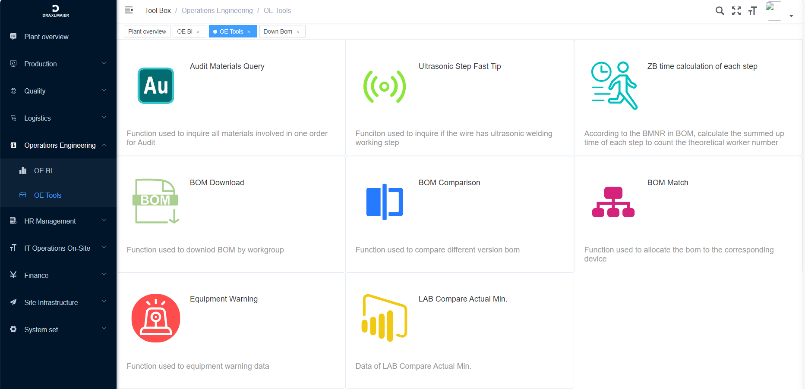
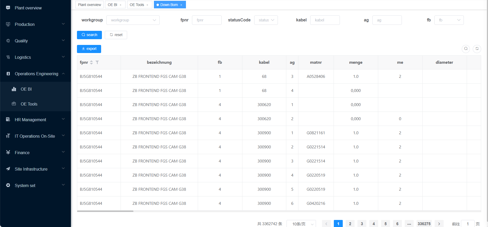
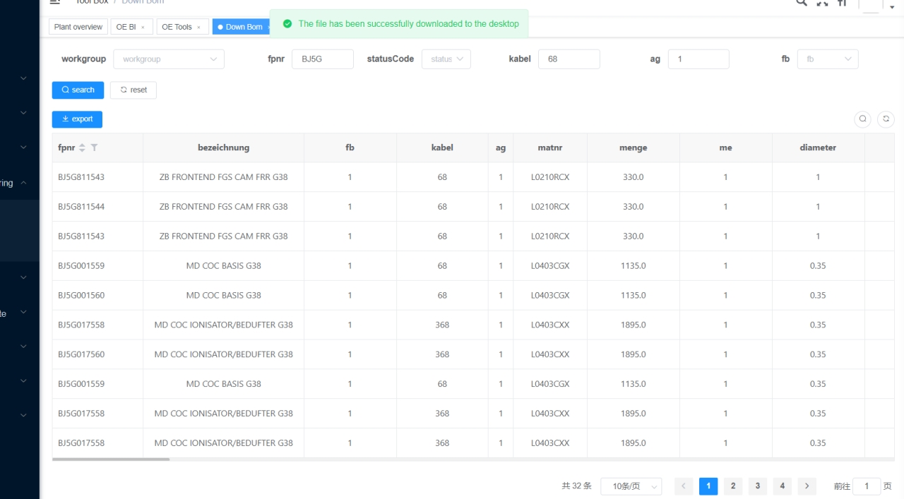

# BOM自动下载

| 版本 | 作者/修改者 | 日期       | 描述             | 提出人     | 提出部门 |
| ---- | ----------- | ---------- | ---------------- | ---------- | -------- |
| V0.1 | Liu Lin     | 2023-12-12 | BOM下载功能说明· | Liu Yipeng | IE       |

<iframe width="800" height="600" src="/videos/bom-download.mp4" title="BOM自动下载" frameborder="0" allow="accelerometer; clipboard-write; encrypted-media; gyroscope; picture-in-picture; web-share" allowfullscreen></iframe>

## 一、引言

### 1.1 目的

通过该文档，可以帮助用户了解BOM下载功能的产生背景、功能范围，以及具体使用方式。

### 1.2 项目背景

当前，在XIA技术部门中，BOM作为基础数据对于变更业务、产能计算都至关重要。

而传统的BOM下载流程，需要用户找到模块号，根据模块号制作Excel，上传到指定目录后，等待集团程序处理后反馈结果。流程繁琐且复杂，存在如下问题：

1. 下载耗时：根据模块数量不同，等待反馈的时间不等，少则20分钟，长则3-5个小时。这时，如果某些临时分析继续BOM数据，就会影响分析进度；
2. 数据错误：系统生成的BOM数据默认以#进行分割列，可有些列中的内容本身就包含#(Position)，这样在通过Excel、CSV进行处理的时候，就会发生窜列的情况；
3. 数据孤立：BOM的模块信息其实和产品组是存在联系的，但系统反馈的BOM数据则无法提现这一点。

鉴于上述问题，我们通过DTools平台，对BOM下载流程进行了优化，改手动下载为全自动下载，用户只需要输入产品组、模块号等查询条件，等待几秒钟就可以完成BOM的自动下载。BOM自动下载流程如下：

1. 定时获取最新的LAB信息；根据LAB中的模块号下载BOM；
2. 收到系统反馈的BOM，处理后存入数据库；
3. 定时获取最新的Workgroup信息，以便实现根据产品组下载BOM的功能；

### 1.3 文档范围

该文档主要适用于IE部门AD、TP组，对于其它需要使用BOM的用户同样适用。

## 二、使用手册

### 2.1 系统登录

具体平台安装，请参考《DTools平台使用手册 v0.1》。

启动DTools，输入账号、密码登录系统，点击左侧Operations Engineering菜单，点击OE Tools菜单项，点击右侧的BOM Download，跳转到具体的BOM下载页面。

页面包含两部分，上方的查询工具栏、下方的BOM清单列表。上方工具栏包含的查询信息如下：

| 字段       | 
中文
 | 
类型
&nbsp;&nbsp;&nbsp; &nbsp; | 备注                                                         |
| ---------- | ---------------------------------- | ----------------------------------------------------------- | ------------------------------------------------------------ |
| workgroup  | 产品组                             | 下拉选框                                                    | 确定所下载BOM归属的产品组，可以下拉选择、可以手动输入模糊匹配； |
| fpnr       | 模块号                             | 输入框                                                      | 确定下载BOM的模块号，支持模糊查询、批量粘贴；                |
| statusCode | 状态号                             | 下拉选框                                                    | 5、6状态；                                                   |
| kabel      | 线号                               | 输入框                                                      | 线号，支持模糊匹配；                                         |
| ag         | 步骤号                             | 输入框                                                      | 精确匹配；                                                   |
| fb         |                                    | 下拉框                                                      | 1、4、5状态，1状态对应KSVK；statusCode=5、fb=4对应模块；statusCode=6、fb=4 对应总装； |

### 2.2 BOM下载

输入查询条件后，点击Search按钮后，下方将展示查询结果。如需要将结果导出，则点击Export即可。

::: tip 

可以不Search，直接点击Export下载

:::

点击Export按钮后，根据下载文件的大小需要等待一段时间，当看到“The file has been successfully downloaded to the desktop”字样，则表示文件已经被下载到了本地桌面。

文件在桌面上bom_xxxx.csv字样，打开后即可查看具体的BOM数据。

## 三、问题反馈

BOM数据按天、根据最新的LAB信息自动下载。如遇到数据缺失的问题、使用上的一些优化需求，请可通过如下方式联系我们：

<RightMenu />
